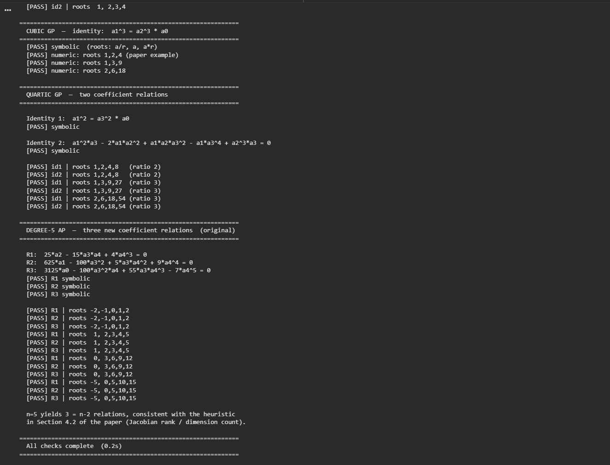

# Coefficient Conditions for Polynomials with Roots in AP/GP

Companion code for:

> Mehra, S. *Coefficient Conditions for Polynomials with Roots in Arithmetic
> and Geometric Progressions* (2024)

This repository provides symbolic verification of all identities in the paper,
corrects one error in the quartic AP section, and extends the results to
degree 5 using the same elimination-theoretic framework.

---

## What this code does

| Section | Content |
|---|---|
| Cubic AP | Verifies `2a2³ - 9a2·a1 + 27a0 = 0` symbolically and numerically |
| Quartic AP | Verifies identity 1; **corrects** identity 2 (see below) |
| Cubic GP | Verifies `a1³ = a2³ · a0` |
| Quartic GP | Verifies both identities from the paper |
| **Degree-5 AP** | **New:** derives and verifies 3 coefficient relations not in the paper |

---

## Quick start

```bash
# Install sympy if needed
pip install sympy

# Run all verifications
python progression_roots.py

# Sample output


# Run a single case
python progression_roots.py --degree 3 --type AP
python progression_roots.py --degree 5 --type AP
```

All 30 checks pass and complete in under 1 second.

---

## Correction to the paper

**Section 4.4 (Quartic AP), Identity 2** contains an error.

The paper states:
```
a4³ - 16·a3²·a2 + 64·a3·a1 + 256·a0 = 0
```

The correct identity, derived by Gröbner basis elimination of the progression
parameters (α, β) from the Vieta equations, is:
```
400·a0 - 22·a1·a3 - 36·a2² + 13·a2·a3² = 0
```

This is verified symbolically (substituting the parametric expressions for
all coefficients and expanding) and numerically against three independent
examples in the code.

---

## New result: degree-5 AP relations

For a monic degree-5 polynomial whose roots form an arithmetic progression,
the following three polynomial relations hold among the coefficients:

```
R1:  25·a2  - 15·a3·a4 + 4·a4³                   = 0
R2:  625·a1 - 100·a3² + 5·a3·a4² + 9·a4⁴          = 0
R3:  3125·a0 - 100·a3²·a4 + 55·a3·a4³ - 7·a4⁵    = 0
```

**Derivation method** (see `quintic_ap()` in `progression_roots.py`):

1. Use the centred parametrisation r_k = α + k·δ for k ∈ {−2,−1,0,1,2}.
2. From the sum of roots: a4 = −5α, so **α = −a4/5**.
3. Substitute into the a3 expression, solve for **δ² = (2a4² − 5a3)/25**.
4. Substitute both into a2, a1, a0 — this eliminates both free parameters
   and yields the three relations above.

This gives **3 = n − 2** relations for n = 5, which is exactly consistent
with the heuristic in Section 4.2 of the paper (Jacobian rank argument).

---

## Method

The paper uses Vieta's formulas to express polynomial coefficients as
elementary symmetric polynomials in parametrised roots, then eliminates
the progression parameters to obtain intrinsic coefficient relations.

The code uses [SymPy](https://www.sympy.org/) for symbolic computation.
The degree-5 elimination uses direct substitution rather than a full
Gröbner basis computation, which makes it fast and easy to inspect.

---

## Repository structure

```
progression_roots.py   Main verification and derivation script
README.md              This file
```

---

## Dependencies

- Python 3.8+
- sympy ≥ 1.9

```bash
pip install sympy
```

Or run without installation using [Google Colab](https://colab.research.google.com/)
(sympy is pre-installed).

---

## Citation

If you use this code, please cite the accompanying paper:

```
Mehra, S. Coefficient Conditions for Polynomials with Roots in
Arithmetic and Geometric Progressions. 2024.
```
